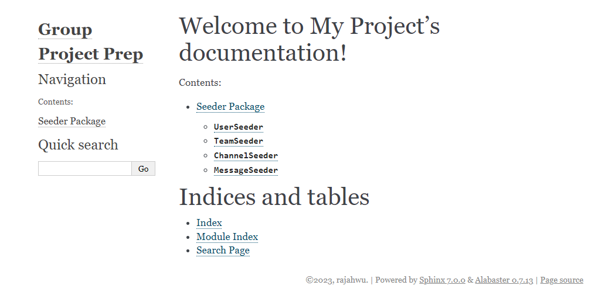

# Seeders

## Docs



### View Docs in brower

```bash
# cd into project_prep/_build/html
cd pre_group_project/project_prep/_build/html

# run python server
python -m http.server

# view in browers
http://localhost:8000/

```

## Seed commands

```py
from flask.cli import AppGroup
from .users import *
from .teams import *
from .channels import *
from .messages import *
from .clear_data import clear_all


seed_commands = AppGroup("seed")

users = UserSeeder()
teams = TeamSeeder()
channels = ChannelSeeder()
messages = MessageSeeder()

RED = '\033[91m'
GREEN = '\033[92m'
YELLOW = '\033[93m'
RESET = '\033[0m'


@seed_commands.command("all")
def seed():
    clear_all()

    num_of = {
        "users": 5,
        "teams": 5,
        "channels": 5,
        # random messages in range(1, messages_per_user)
        "messages_per_user": 5
    }

    user_records = users.generate_users(num_of["users"])
    if len(user_records) != num_of["users"]:
        raise ValueError(
            RED + "Failed to generate the expected number of user records") + RESET
    else:
        print(
            f'{GREEN}{num_of["users"]} User records successfully generated{RESET} \n {user_records}')

    team_records = teams.generate_teams(num_of["teams"])
    if len(team_records) != num_of["teams"]:
        raise ValueError(
            RED + "Failed to generate the expected number of user records" + RESET)
    else:
        print(
            f'{GREEN}{num_of["teams"]} Team records successfully generated{RESET} \n {team_records}')

    channel_records = channels.generate_channels(num_of["channels"])
    if len(channel_records) != num_of["channels"]:
        raise ValueError(
            RED + "Failed to generate the expected number of channel records" + RESET)
    else:
        print(
            f'{GREEN}{num_of["channels"]} Channel Records Generated{RESET} \n {user_records}')

    message_records = messages.generate_messages(
        num_of["messages"], users=user_records, channels=channel_records)
    if len(message_records) < num_of["messages_per_user"]:
        raise ValueError(
            RED + "Failed to generate the expected number of message records" + RESET)
    else:
        print(
            f'{GREEN}{num_of["messages_per_user"]} Messages Records Generated{RESET} \n {message_records}')


@seed_commands.command("undo")
def undo():
    clear_all()

```

## Models

### Users

```py
from faker import Faker
from app.db.dev import db
from app.db.models import User


class UserSeeder:
    """
    Seeder class for generating user data.
    """

    def __init__(self):
        """
        Initialize the UserSeeder class.
        """
        self.fake = Faker()

    def generate_users(self, count):
        """
        Generate a specified number of user records.

        Args:
            count (int): The number of user records to generate.

        Returns:
            list : A list of generated user records.
        """
        for _ in range(count):
            user = User(
                first_name=self.fake.first_name(),
                last_name=self.fake.last_name(),
                email=self.fake.email(),
                hashed_password="password"
            )
            db.session.add(user)
        db.session.commit()

        users = User.query.all()
        return users

    @classmethod
    def get_all_users(cls):
        """
        Querys for all user records.

        Returns:
            list: A list of all user records.
        """
        return User.query.all()

    @classmethod
    def clear_users(cls):
        """
        Deletes all user records.

        Returns:
            int: Number of deleted user records.
        """
        
        num_deleted = db.session.query(User).delete()
        db.session.commit()
        return num_deleted

```

### Teams

```py
from faker import Faker
from app.db.dev import db
from app.db.models import Team


class TeamSeeder:
    """
    Seeder class for generating team data.
    """
    def __init__(self):
        """
        Initialize the TeamSeeder class.
        """
        self.fake = Faker()

    def generate_teams(self, count):
        """
        Generate a specified number of team records.

        Args:
            count (int): The number of team records to generate.

        Returns:
            list: A list of generated team records.
        """
        for _ in range(count):
            team = Team(name=self.fake.bs(),
                        image_url=self.fake.image_url())
            db.session.add(team)
        db.session.commit()
        teams = Team.query.all()
        return teams

    @classmethod
    def get_all_teams(cls):
        """
        Querys for all team records

        Returns:
            list: A list of all team records.
        """
        return Team.query.all()

    @classmethod
    def clear_teams(cls):
        """
        Deletes all user records.

        Returns:
            int: Number of deleted team records.
        """
        num_deleted = db.session.query(Team).delete()
        db.session.commit()
        return num_deleted
```

### Channels

```py
from faker import Faker
from random import choice
from app.db.dev import db
from app.db.models import Channel
from app.db.seeders import UserSeeder, TeamSeeder


class ChannelSeeder:
    """
    Seeder class for generating channel data.
    """
    def __init__(self):
        """
        Initialize the ChannelSeeder class.
        """
        self.fake = Faker()

    def generate_channels(self, num=0):
        """
        Generates a specified number of channel records.

        Args:
            num (int, optional): The number of channel records to generate. Defaults to the number of teams.

        Returns:
            list: A list a generated channel records.
        """
        teams = TeamSeeder.get_all_teams()

        if len(teams) == 0:
            TeamSeeder.generate_teams(5)
            teams = TeamSeeder.get_all_teams()

        num_channels = len(teams) if num == 0 else num
        for _ in range(num_channels):
            channel = Channel(
                team_id=choice(teams).id,
                name=self.fake.bs()
            )
            db.session.add(channel)
        db.session.commit()
        channels = Channel.query.all()
        return channels

    @classmethod
    def get_all_channels(cls):
        """
        Querys for all channel records

        Returns:
            list: A list of all channel records.
        """
        return Channel.query.all()

    @classmethod
    def clear_channels(cls):
        """
        Deletes all channel records.

        Returns:
            init: Number of deleted channel records.
        """
        num_deleted = db.session.query(Channel).delete()
        db.session.commit()
        return num_deleted

```

### Messages

```py
from faker import Faker
from random import choice, randint
from app.db.dev import db
from app.db.models import Message
from app.db.seeders import UserSeeder, ChannelSeeder


class MessageSeeder:
    """
    Seeder class for generating message records.
    """

    def __init__(self):
        self.fake = Faker()

    def generate_messages(self, num=3, users=None, channels=None):
        """
        Generate a random number of messages for all users: range(1, num).

        Args:
            num (int, optional): End range for number of messages. Defaults to 3.
            users (list, optional): List of users to generates messages for. Defaults to None.
            channels (list, optional): List of channels to assigns messages to.

        Returns:
            list: A list of generated message records.
        """

        if not users:
            users = UserSeeder.get_all_users()

        if not channels:
            channels = ChannelSeeder.get_all_channels()

        for user in users:
            for _ in range(randint(1, num)):
                message = Message(
                    user_id=user.id,
                    channel_id=choice(channels).id,
                    text=self.fake.sentence(),
                    sent_at=self.fake.date_time()
                )
                db.session.add(message)
        db.session.commit()
        messages = Message.query.all()
        return messages

    @classmethod
    def clear_messages(cls):
        """
        Deletes all message records.

        Returns:
            int: Number of deleted message records.
        """
        num_deleted = db.session.query(Message).delete()
        db.session.commit()
        return num_deleted
```
